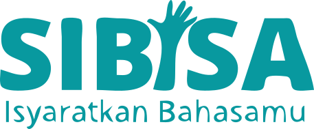
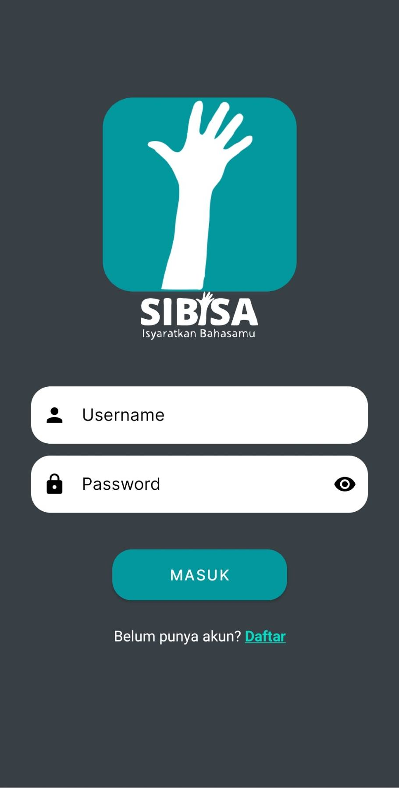
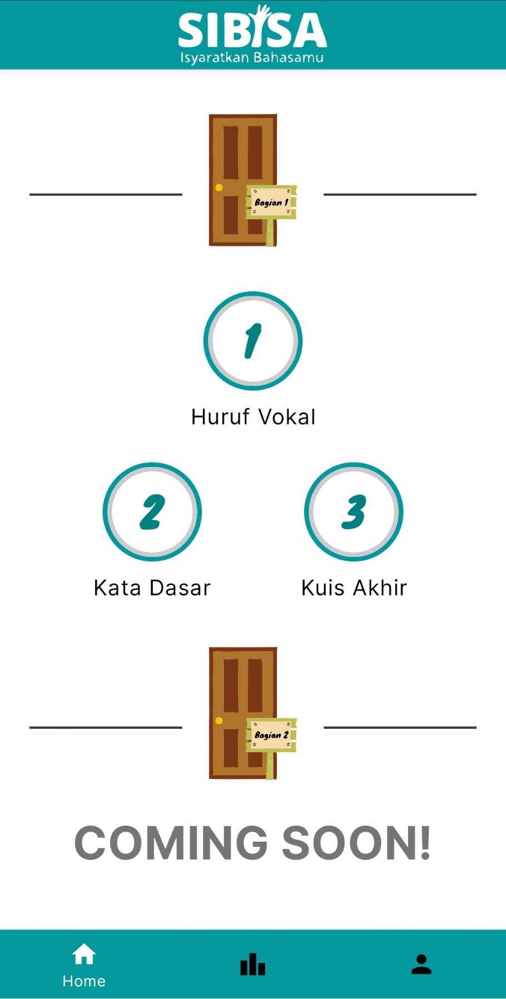
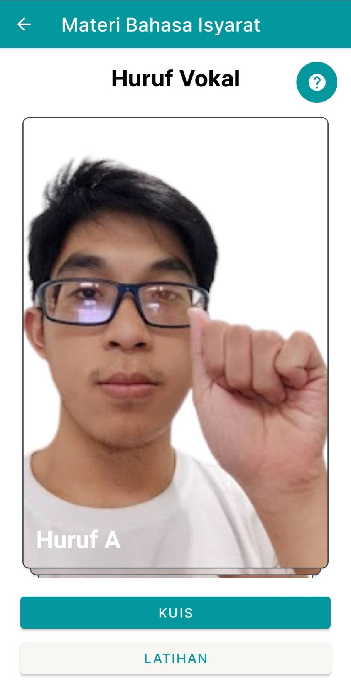
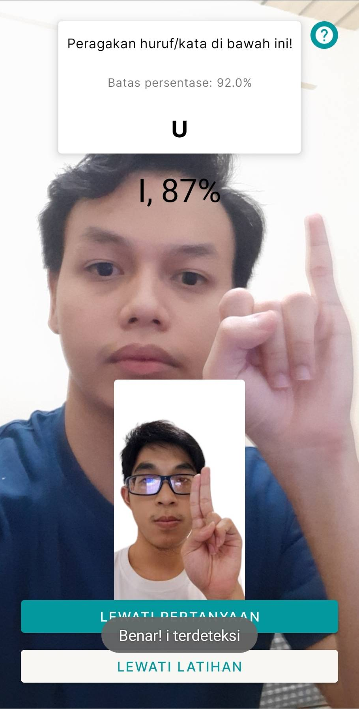
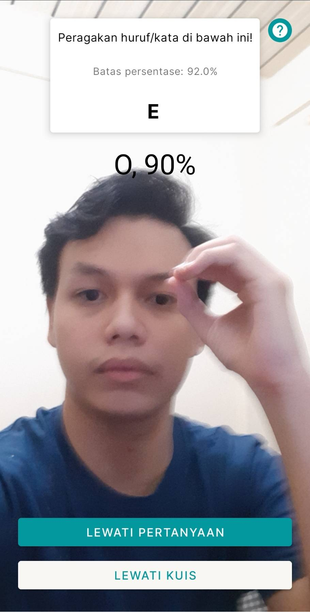
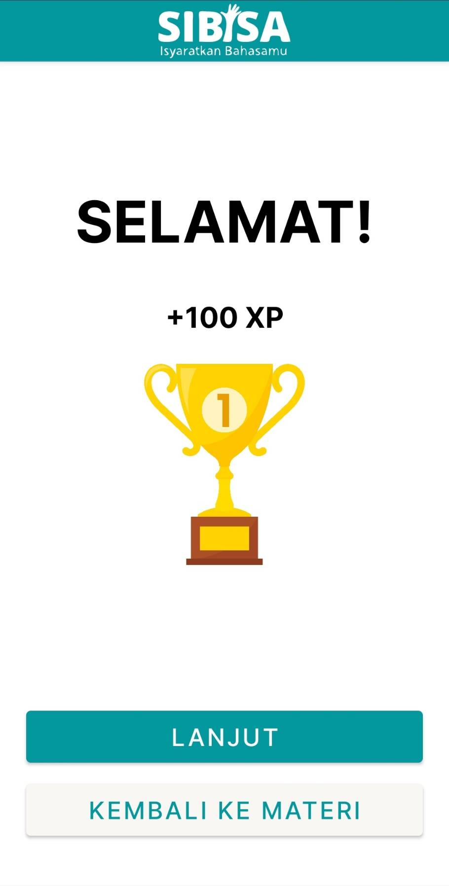
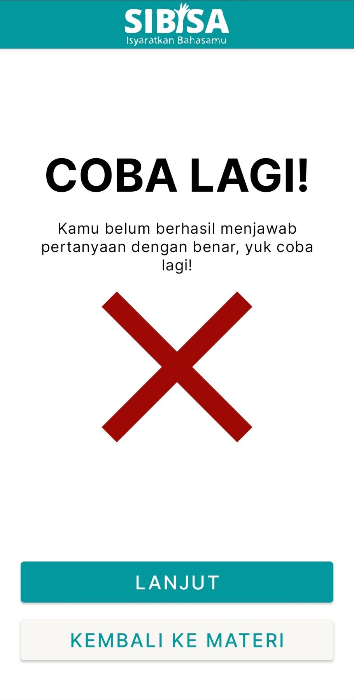
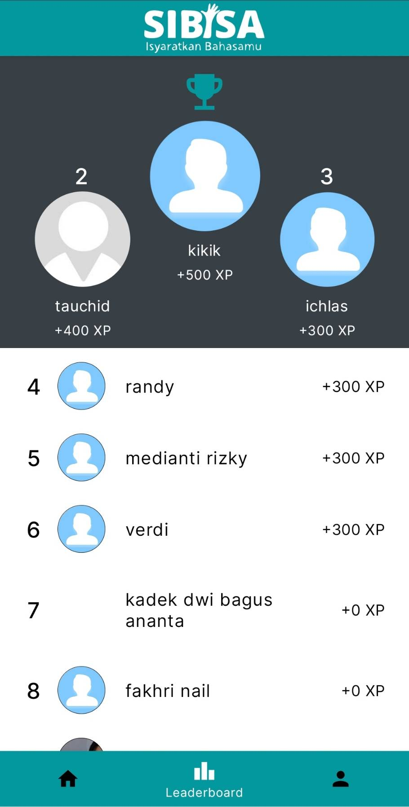
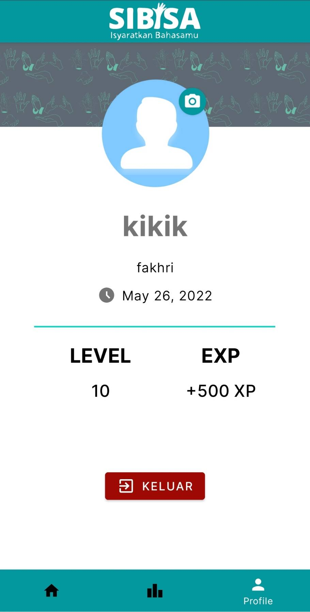

    
    <h1><strong>SIBISA</strong></h1>
    

    SIBI sign language education platform with gamification approach powered by machine learning. 
    This is a project to fulfill the  <a href="https://grow.google/intl/id_id/bangkit/"><strong>Bangkit Academy led by Google, GoTo, & Traveloka »</strong></a> Program.
    

 
 

## Table of Content
* [About the Project](#about-the-project)
* [Documentation](#documentation)
* [Usage](#usage)
* [Feature](#feature)
* [Capstone Project Teams](#capstone-project-teams)

## About the Project
SIBISA is an Indonesian sign language (SIBI) learning app. SIBISA is inspired by Duolingo, and its goal is to popularize learning sign language to help accomodate the deaf community in day-to-day life for a more inclusive society and environment.

## Documentation
Here are links to documentation of some of the learning paths that make up this app:
* [Machine Learning Documentation](https://github.com/SIBISA-github/sibisa-ml)
* [Mobile Development Documentation](https://github.com/SIBISA-github/sibisa-android)
* [Cloud Computing Documentation](https://github.com/SIBISA-github/sibisa-be)

## Usage
Get the app [here](https://drive.google.com/uc?export=download&id=18qhUjT0vGtwQ665TcCA1UzamvOGEzi7U) and install it using package installer

## Feature
### Login and Register

    
    

### Home Page

### Lesson

### Exercise

### Quiz

### Quiz Result

    
    

### Leaderboard

### Profile Menu

 

## Capstone Project Teams
| Name                           | Bangkit ID | LinkedIn Profile                                |
|--------------------------------|------------|-------------------------------------------------|
| Muh Ichlasul Amal              | M7004F0176 | https://www.linkedin.com/in/muh-ichlasul-amal/  |
| Randy Zakya Suchrady           | M2002F0098 | https://www.linkedin.com/in/randyzakya/         |
| Fakhri Nail Wibowo             | A2002F0093 | https://www.linkedin.com/in/fakhrinail/         |
| Verydian Triwidodo             | A2387F2942 | https://www.linkedin.com/in/verydian-triwidodo/ |
| Kadek Dwi Bagus Ananta Udayana | C2002F0097 | https://www.linkedin.com/in/dwibagus154/        |
| Mohammad Tauchid               | C2004F0322 | https://www.linkedin.com/in/mohammad-tauchid/   |